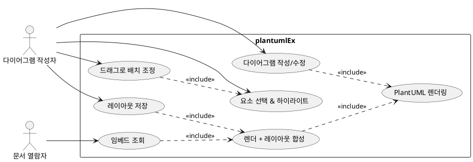

# plantumlEx — Architecture

## 1. Overview

plantumlEx는 **서버에서 PlantUML 렌더링과 레이아웃 합성을 수행**하고, **클라이언트는 편집(드래그)에만 집중**하는 경량 구조를 따른다. 임베드 소비자(사내 위키/문서 등)는 `<iframe>` 한 줄 또는 `` 한 줄로 최종 합성된 다이어그램을 표시할 수 있다.

```
[편집]   작성 → POST /render → raw SVG → 클라에서 드래그 → PUT /layouts/:id
[임베드] <iframe src="/embed/{id}"> → 서버: render + layout 합성 → 최종 SVG
```

핵심 설계 원칙

- **편집은 클라이언트, 최종 합성은 서버.** 임베드 쪽에 JS가 침투하지 않는다.
- **원본 PlantUML 소스는 수정하지 않는다.** 레이아웃은 별도 델타로만 저장.
- **레이아웃 키는 소스 해시가 아니라 `diagram_id`.** 소스가 바뀌어도 살아남은 노드 ID의 레이아웃은 유지.

## 2. Use Case

아래 다이어그램은 [docs/usecase.puml](./usecase.puml) 참고.



## 3. Components

### 3.1 Server (단일 서비스)

| 엔드포인트 | 역할 |
|---|---|
| `POST /render` | PlantUML 소스 → raw SVG (저장 없음) |
| `POST /diagrams` | 다이어그램 생성 (id 발급) |
| `GET  /diagrams/:id` | 소스 + 레이아웃 조회 |
| `PUT  /diagrams/:id` | 소스/이름 저장 |
| `PUT  /layouts/:id` | 레이아웃 델타 저장 |
| `GET  /embed/:id` | 합성된 SVG를 감싼 HTML 페이지 (iframe용) |
| `GET  /embed/:id.svg` | 합성된 SVG (img 태그용) |
| `GET  /edit/:id` | 에디터 SPA 페이지 |

### 3.2 Renderer
- **PlantUML jar를 서브프로세스로 호출.** (`java -jar plantuml.jar -tsvg -pipe`)
- stdin ← 소스 / stdout → SVG.
- 운영 단계에서 Kotlin/Java로 전환 시 라이브러리 직접 호출로 성능 개선 가능.

### 3.3 Compositor (서버 측 합성 로직)
1. PlantUML로 raw SVG 생성.
2. `layouts` 저장소에서 해당 diagram의 델타 조회.
3. SVG 내 `<g id="elem_X">`에 `transform="translate(dx, dy)"` 주입.
4. (향후) 연결된 edge(`<g id="link_...">`)의 양 끝점 좌표 보정.
5. 결과 SVG 반환.

### 3.4 Client (Editor)
- 단일 HTML + vanilla JS.
- 좌측 패널: PlantUML 소스 편집 (textarea).
- 우측 패널: SVG 프리뷰 + 노드 드래그.
- `Render` → `/render` 호출, `Apply` → `/layouts/:id` 저장.

## 4. Data Flow

### 4.1 편집 플로우

```
Author ──[소스 작성]──▶ Editor
Editor ──POST /render──▶ Server ──spawn──▶ plantuml.jar
Editor ◀── raw SVG ──── Server
Author ──[드래그]──▶ Editor (state.layout 업데이트, DOM transform 적용)
Editor ──PUT /layouts/:id──▶ Server ──[JSON 저장]──▶ data/
```

### 4.2 임베드 플로우

```
Reader ──GET /embed/:id──▶ Server
Server ──▶ renderer(raw SVG) + loadLayout(:id) ──▶ compositor ──▶ 최종 SVG
Server ──HTML 응답──▶ Reader
```

## 5. Data Model

```
diagrams/{id}.json
{
  "id": "abc123",
  "name": "OrderSystem",
  "source": "@startuml ... @enduml",
  "layout": {
    "elem_Order":    { "dx":  40, "dy": -20 },
    "elem_Customer": { "dx": -30, "dy":  10 }
  },
  "updatedAt": 1714000000000
}
```

PoC는 파일(JSON) 저장, 운영 전환 시 SQLite → Postgres 순으로 이행.

## 6. Tech Stack

| 레이어 | PoC | 운영 전환 후보 |
|---|---|---|
| Backend | Node.js + Express | Kotlin + Spring Boot / Ktor |
| Renderer | `java -jar plantuml.jar` (서브프로세스) | PlantUML 라이브러리 직접 호출 |
| SVG 조작 | cheerio | jsoup (Kotlin) |
| 저장소 | JSON 파일 | SQLite → Postgres |
| Frontend | 단일 HTML + vanilla JS | 필요 시 Svelte/Alpine |
| 인증 | 없음 | 사내 SSO (OIDC) |

## 7. Known Limitations (PoC)

- **연결선 재라우팅 없음.** 노드만 translate하고 edge는 원본 위치에 남음 → 노드 이동 시 시각적으로 분리됨.  
  → v2에서 `link_A_B` 패턴에서 endpoint 추출하여 보정 예정.
- **클래스/컴포넌트 다이어그램 위주.** `elem_` prefix를 사용하지 않는 일부 다이어그램 유형은 드래그 대상에서 제외.
- **다중 선택/그룹 이동 미지원.**
- **스냅/가이드라인 미지원.**
- **동시 편집 충돌 처리 없음** (last-write-wins).

## 8. Getting Started (PoC)

```bash
# 전제: java, node 18+ 설치됨. plantuml.jar 준비.
#   curl -L -o plantuml.jar https://github.com/plantuml/plantuml/releases/latest/download/plantuml.jar

cd /path/to/plantumlEx
npm install
PLANTUML_JAR=$PWD/plantuml.jar npm start
# open http://localhost:3000
```

1. `New` → 샘플 소스가 채워짐.
2. `Render` → 우측에 SVG 표시.
3. `Save Source` → diagram_id 발급.
4. 노드 드래그 → 실시간 이동.
5. `Apply Layout` → 서버에 델타 저장.
6. `Embed → /embed/{id}` 링크로 합성 결과 확인.

## 9. Roadmap

- **v0.1 (PoC, 현재)**: 노드 드래그 + 레이아웃 저장 + 임베드 합성.
- **v0.2**: edge endpoint 보정, 다중 선택, 소스 변경 시 레이아웃 diff 전략.
- **v0.3**: SQLite 이행, 사내 SSO, 스냅/가이드라인.
- **v1.0**: Kotlin 백엔드 전환, PlantUML 라이브러리 직접 호출, 감사 로그.
