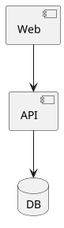

# pumlex (VS Code extension)

Markdown 미리보기 안에서 ` ```plantuml ` 블록을 SVG 로 렌더하고, **그 SVG 위에서 노드를 직접 드래그해 레이아웃을 미세조정**할 수 있는 확장이다. 조정한 위치는 PlantUML 소스 끝의 `' @startmeta` 주석 블록에 임베드돼 한 파일로 보존된다.

> `archi-duke/pumlex` 모노레포의 일부 (`packages/pex-vscode`).
> 전체 구조는 [루트 README](../../README.md) / [architecture.md](../pex-server/docs/architecture.md) 참고.

## 요구사항

- **VS Code** 1.80+
- **plantumlEx 서버** (`packages/pex-server`) — 로컬 실행, 기본 `http://localhost:3030`
- **Java** — PlantUML jar 호출용 (서버 측 요구사항)

## 설치

```bash
# 모노레포 루트에서
npm install
npm run package:vscode                        # → packages/pex-vscode/pumlex-x.y.z.vsix
code --install-extension packages/pex-vscode/pumlex-*.vsix
```

개발 모드: `code packages/pex-vscode` → F5 (Extension Development Host).

## 첫 실행 흐름

**1) plantumlEx 서버 실행** — 별도 터미널에서:

```bash
npm run start:server          # 모노레포 루트, 기본 :3030
# PORT=4000 npm run start:server      # 포트 변경
```

**2) 확장 설정 확인** — `pumlex.serverUrl` 이 위 주소와 일치하는지 (기본값 그대로 두면 됨).

**3) 마크다운에 fence 작성**:

````markdown

````

**4) 미리보기 열기** — `Cmd+K V` (macOS) / `Ctrl+K V`. 처음에는 placeholder 가 잠깐 떴다가 SVG 로 자동 교체된다.

**5) 인라인 편집** — SVG 위에 마우스를 올리면 ✎ 버튼이 뜬다.
- 클릭 → 노드 드래그 / 멀티 셀렉트(Shift+클릭) / 그룹 이동 / 엣지 곡선 핸들
- ✓ 클릭 → 변경된 좌표가 PlantUML 소스의 `' @startmeta` 블록에 기록 (확장이 텍스트 에디터에 `WorkspaceEdit` 적용)
- `Cmd+S` 로 저장

## 명령

| 명령 | 용도 |
|---|---|
| `pumlex: Hello` | 활성화 확인 + 현재 `serverUrl` 표시 |
| `pumlex: Show Status` | 서버 reachability, 캐시 크기, in-flight fetch 수, refresh 시도 횟수 |
| `pumlex: Clear Cache (force re-render)` | 메모리 캐시 비우고 모든 블록 재렌더 |

미리보기 안의 "↻ 재시도" 버튼은 `vscode://archi-duke.pumlex/retry` URI 핸들러로 라우팅 — 오류 캐시만 제거해 SVG 캐시는 깜빡임 없이 유지된다.

## 설정

| 키 | 기본값 | 설명 |
|---|---|---|
| `pumlex.serverUrl` | `http://localhost:3030` | plantumlEx 서버 base URL. 변경 시 캐시 자동 무효화 + 미리보기 새로고침. |
| `pumlex.fenceMatching` | `"all"` | pumlex 가 어떤 fence 를 가져갈지 결정. `"all"` = 모든 ` ```plantuml ` / ` ```puml `. `"marker"` = 다른 plantuml 확장과 공존 시 사용 (아래 참고). |

### `jebbs.plantuml` 등 다른 plantuml 확장과 공존

기본 `"all"` 모드에서는 pumlex 가 모든 plantuml fence 를 가져가므로 다른 markdown-it 기반 plantuml 확장과 충돌할 수 있다. `pumlex.fenceMatching` 을 `"marker"` 로 바꾸면 pumlex 는 다음 두 시그널 중 하나를 만족하는 fence 만 처리한다:

1. **명시적 마커** — info 문자열에 `pumlex` 토큰 포함
   ````markdown
   ```plantuml pumlex
   @startuml
   ...
   @enduml
   ```
   ````
   첫 토큰이 여전히 `plantuml` 이라 다른 확장의 syntax highlighting / 처리는 그대로.

2. **메타 sticky** — 소스 본문에 이미 `' @startmeta` 블록이 있는 경우. pumlex 가 이전에 한 번이라도 편집한 fence 는 마커 없이도 자동 인식 — 모드 전환 후에도 기존 작업물이 끊기지 않게 함.

마커도 메타도 없는 fence 는 다른 확장(또는 markdown-it 기본 코드 블록 렌더러)으로 떨어진다.

## 호환되는 마크다운 뷰어 / 인핸서

pumlex 는 VS Code 의 **built-in markdown preview** 에 markdown-it 플러그인 + preview script 로 부착된다 (`markdown.markdownItPlugins` / `markdown.previewScripts` contribution). 같은 contribution point 를 사용하는 다른 확장과는 자연스럽게 공존하므로, 다음과 같은 인핸서들과 함께 사용해도 인라인 편집이 그대로 동작한다:

| 확장 | 추가되는 기능 |
|---|---|
| `bierner.markdown-mermaid` | mermaid 다이어그램 |
| `bierner.markdown-preview-github-styles` | GitHub 스타일링 |
| `goessner.mdmath` 또는 `bierner.markdown-it-katex` | KaTeX 수식 |
| `bierner.markdown-emoji` / `bierner.markdown-yaml-preamble` | emoji / YAML preamble |
| `yzhang.markdown-all-in-one` | TOC / 단축키 / 리스트 편집 (preview 자체는 built-in 사용) |

**Markdown Preview Enhanced (MPE, `shd101wyy.markdown-preview-enhanced`)** 는 자체 webview 와 mume 기반 파이프라인을 사용해 built-in preview 를 완전히 대체한다. 그래서:

- pumlex 의 markdown-it 플러그인은 MPE preview 에서 실행되지 않는다 — 인라인 편집 불가.
- MPE 가 제공하는 third-party API 는 사용자 워크스페이스의 `parser.js` 뿐이고, 이건 third-party 확장이 programmatic 으로 주입할 수 없다.

**권장 워크플로우**: pumlex 사용자는 인라인 편집이 필요한 작업은 **built-in preview** 로 (Cmd+K V), MPE 의 다른 기능 (presentation, PDF export 등) 이 필요할 때만 MPE 를 켜는 식으로 두 preview 를 병행. 두 미리보기 패널은 같은 `.md` 에 대해 동시에 띄울 수 있다.

## CSP / 웹뷰 권한 — 별도 설정 불필요

확장은 **extension host 측에서** `pumlex.serverUrl` 을 호출하고 SVG 를 markdown 페이지에 inline 시킨다. 결과적으로:

- markdown preview webview 자체는 외부 네트워크 접근이 없어도 동작 (`connect-src` 사용 안 함)
- 인라인 편집의 edit / commit / retry 액션은 webview 안에서 클릭 가능한 `vscode://archi-duke.pumlex/...` 링크로 처리되며, VS Code 의 standard URI handler 가 라우팅
- 별도로 띄우는 에디터 패널(`editorPanel.ts`)은 자체 CSP 에 plantumlEx 서버 origin 을 허용 — 사용자가 건드릴 필요 없음

`pumlex.serverUrl` 을 원격 호스트(예: 사내 서버) 로 바꿔도 markdown preview CSP 영향은 없다.

## 트러블슈팅

| 증상 | 원인 / 해결 |
|---|---|
| placeholder 가 사라지지 않음 | 서버 미가동. 미리보기 안 안내 + "↻ 재시도" 버튼 사용. `npm run start:server` 로 기동. |
| "render error" 표시 | PlantUML 소스 자체 오류. 에디터로 돌아가 라인 메시지 확인. |
| `serverUrl` 변경 후 옛 SVG 가 잠깐 보임 | 활성 미리보기는 자동 무효화되지만 다른 `.md` 의 미리보기는 재오픈 필요할 수 있다. `pumlex: Clear Cache` 실행. |
| ✓ 클릭 후 소스 갱신 안 됨 | 해당 markdown 파일이 열려 있어야 함 (확장이 `workspace.textDocuments` 에서 매칭). 닫혀 있으면 "블록 #N 을 찾지 못했습니다" 안내. |
| `' @startmeta` 가 자동 추가 안 됨 | 메타 없는 블록의 첫 편집 시 동작 검증은 ROADMAP **D-2** 진행 중. 수동으로 한번 ✓ 누르면 추가된다. |

진단이 더 필요하면 `pumlex: Show Status` 실행. 서버 reachability 와 캐시 통계가 한눈에 표시된다.

## 알려진 제약

- **시퀀스 / 활동 다이어그램 인라인 편집 미지원** (ROADMAP **E-4**). 컴포넌트 / 상태 / 유스케이스 / 클래스 다이어그램은 지원.
- **MPE preview 에서는 인라인 편집 불가** — 자체 webview 사용 + third-party 확장이 주입할 API 부재. built-in preview 로 편집 후 MPE 는 표시 전용으로 사용. 위 "호환되는 마크다운 뷰어 / 인핸서" 섹션 참고.

## 라이선스

MIT — [LICENSE](../../LICENSE)
