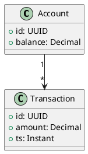
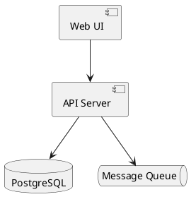

# pumlex 샘플

이 문서는 pumlex 익스텐션 동작을 확인하기 위한 샘플입니다. VS Code의 마크다운 미리보기(`Cmd+Shift+V` 또는 `Cmd+K V`)에서 아래 plantuml 블록이 SVG로 교체되어야 합니다.

## 클래스 다이어그램

```plantuml
@startuml
class Customer {
   id: UUID
   name: String
}
class Order {
   id: UUID
}
class Product {
   sku: String
}
Customer "1" --> "*" Order
Order "*" --> "*" Product
@enduml

' @startmeta
' {
'   "schema": 1,
'   "layout": {
'     "nodes": {
'       "Order": {
'         "dx": 239,
'         "dy": 1
'       }
'     },
'     "edges": {
'       "Order__Product": {
'         "type": "curve",
'         "u2": {
'           "x": -83.11315059661865,
'           "y": -0.9882284440632816
'         },
'         "u1": {
'           "x": -68.69726470280636,
'           "y": 9.860203842849629
'         },
'         "texts": {
'           "0": {
'             "dx": 48,
'             "dy": -7
'           }
'         }
'       },
'       "Customer__Order": {
'         "type": "curve",
'         "u2": {
'           "x": 115.6683521270752,
'           "y": 2.595307463436086
'         },
'         "u1": {
'           "x": 106.83798217773438,
'           "y": 22.053878046977474
'         },
'         "texts": {
'           "0": {
'             "dx": -35,
'             "dy": -16
'           },
'           "1": {
'             "dx": -7,
'             "dy": -11
'           }
'         }
'       }
'     }
'   }
' }
' @endmeta
```



## 유스케이스 다이어그램 (메타 임베드 포함)

```plantuml
@startuml
left to right direction
actor Admin
rectangle System {
  usecase "Manage Users" as UC1
  usecase "View Reports" as UC2
}
Admin --> UC1
Admin --> UC2
@enduml

' @startmeta
' {
'   "schema": 1,
'   "layout": {
'     "nodes": {
'       "Admin": {
'         "dx": 370,
'         "dy": -49
'       },
'       "System.UC2": {
'         "dx": -80,
'         "dy": -9
'       },
'       "System.UC1": {
'         "dx": 50,
'         "dy": 5
'       }
'     },
'     "edges": {
'       "Admin__System.UC2": {
'         "type": "curve",
'         "u2": {
'           "x": -82.13194274902344,
'           "y": 13.872110702694606
'         },
'         "u1": {
'           "x": -64.74630737304688,
'           "y": -5.0785842981107905
'         }
'       }
'     }
'   }
' }
' @endmeta
```



위 두 번째 블록은 `Admin` 액터를 380px 우측으로 이동하는 메타가 임베드되어 있어 미리보기에서 그대로 반영되어야 합니다.

## 메타 없는 클래스 (첫 편집 시 메타 자동 추가 검증용)

이 블록은 `' @startmeta` 블록이 없습니다. ✎ 편집 → 엔티티 드래그 → ✓ 완료 시 마크다운에 메타가 새로 끼어들어가야 합니다.



## 컴포넌트 다이어그램



## 상태 다이어그램

```plantuml
@startuml
[*] --> Idle
Idle --> Loading : fetch
Loading --> Ready : ok
Loading --> Error : fail
Ready --> [*]
Error --> Idle : retry
@enduml

' @startmeta
' {
'   "schema": 2,
'   "layout": {
'     "nodes": {
'       "Idle": {
'         "dx": -23,
'         "dy": -10
'       }
'     },
'     "edges": {
'       "Idle__Loading": {
'         "type": "curve",
'         "u2": {
'           "x": 16.825212576093463,
'           "y": 41.932464599609375
'         },
'         "u1": {
'           "x": -20.817190072832318,
'           "y": 26.661834716796875
'         },
'         "texts": {
'           "0": {
'             "dx": -61,
'             "dy": 8
'           }
'         }
'       },
'       "Error__Idle": {
'         "type": "curve",
'         "texts": {
'           "0": {
'             "dx": 12,
'             "dy": -10
'           }
'         }
'       },
'       "Loading__Ready": {
'         "type": "straight",
'         "texts": {
'           "0": {
'             "dx": -25,
'             "dy": -4
'           }
'         }
'       }
'     },
'     "participants": {}
'   }
' }
' @endmeta
```



## 일반 코드 블록 (변형 안 됨)

```python
print("hello")
```

```bash
echo "이 블록도 plantumlEx 가 건드리지 않아야 합니다"
```
