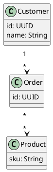

# pumlex 샘플

이 문서는 pumlex 익스텐션 동작을 확인하기 위한 샘플입니다. VS Code의 마크다운 미리보기(`Cmd+Shift+V` 또는 `Cmd+K V`)에서 아래 plantuml 블록이 SVG로 교체되어야 합니다.

## 클래스 다이어그램



## 유스케이스 다이어그램 (메타 임베드 포함)

```plantuml
@startuml
left to right direction
actor Admin
rectangle System {
  usecase "Manage Users" as UC1
  usecase "View Reports" as UC2
}
Admin --> UC1
Admin --> UC2
@enduml

' @startmeta
' {
'   "schema": 1,
'   "layout": {
'     "nodes": {
'       "Admin": {
'         "dx": 358,
'         "dy": -1
'       }
'     },
'     "edges": {
'       "Admin__System.UC2": {
'         "type": "curve",
'         "u2": {
'           "x": -66.93325805664062,
'           "y": 8.740741995181736
'         },
'         "u1": {
'           "x": -40.30217788497218,
'           "y": 5.460802296456813
'         }
'       },
'       "Admin__System.UC1": {
'         "type": "curve",
'         "u2": {
'           "x": -54.547935485839844,
'           "y": -22.11752976096841
'         },
'         "u1": {
'           "x": -39.40150263988092,
'           "y": -5.250577329410255
'         }
'       }
'     }
'   }
' }
' @endmeta
```



위 두 번째 블록은 `Admin` 액터를 380px 우측으로 이동하는 메타가 임베드되어 있어 미리보기에서 그대로 반영되어야 합니다.

## 일반 코드 블록 (변형 안 됨)

```python
print("hello")
```
